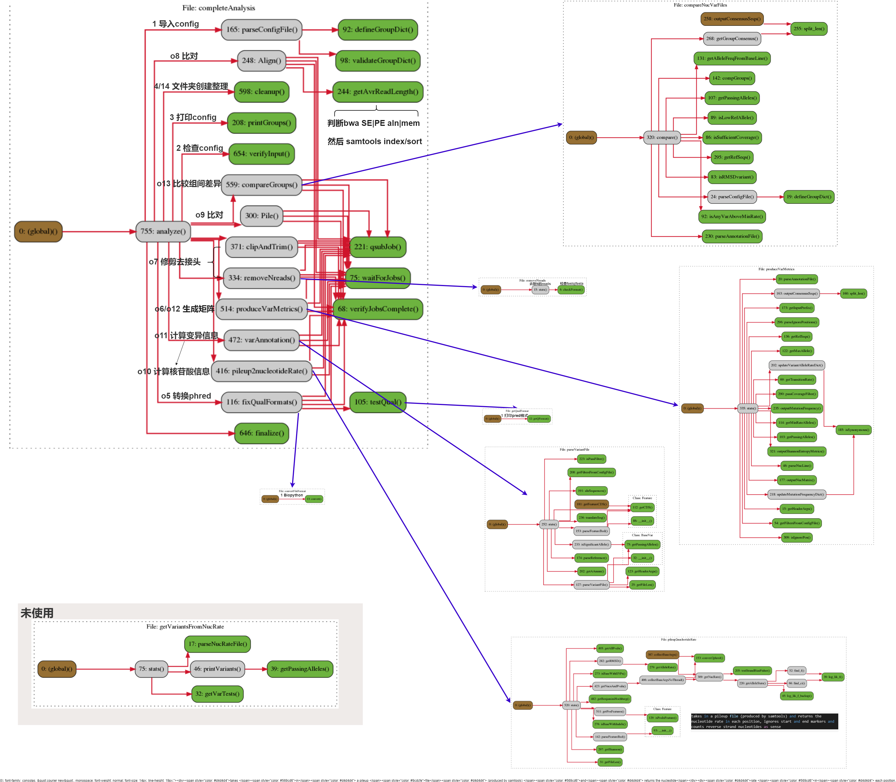

# **ViVan** Fix Version
[](https://github.com/cherryamme/ViVan/stargazers)         


old_README.txt 为软件原始的说明文档，提供了软件的功能说明和参数设置。


## 使用须知
原先软件为python2.6版本编写，*该版本py脚本已经被我改为3.X版本。* 可能会引发一些未知的问题。

## 软件依赖
- SAMtools在系统PATH下需要能够调用
- BWA-0.7.8、ea-utils文件夹为组件，受python脚本调用
- 另外需要安装包 Biopython, scipy and numpy，可以通过conda或者pip安装。

## 软件流程

ViVan_flow.png 显示了该软件的执行图，以/completeAnalysis.py 为核心的流程


> - 以completeAnalyss为main脚本使用。
> - 蓝色箭头表示该处调用其他py脚本。
> - 1→2→3表示执行顺序。 o表示该步骤在参数中可选，如o6可以设置不执行。
> - 绿色模块表示基础函数，未调用其它函数。
> 



## 配置文件:

配置文件均放置在运行工作目录，fastq文件和参考基因组任意位置均可

## 运行主python文件

./completeAnalysis.py

在该文件的前面配置工作目录变量。如：SCRIPTS_DIR = '/home/jc/ViVan/VV-source-py3'

将SCRIPTS_DIR更改为工作的主要目录。在Linux下可用pwd命令查看。

配置使用的bwa软件的位置。如：BWA_PATH = '%s/bwa-0.7.8/bwa'%SCRIPTS_DIR  #一般不用修改此处，软件包内有提供bwa

## config文件
**config文件 需要配置输入的样本**

./sample-configuration-file

### 输入样本信息
参照样例,以如下格式修改: 脚本扫描(#samples_start)起始行,(#samples_end)终止行，第二列为分组，中间以/t分割，单端测序只需一个文件.

```txt
#samples_start
sample1	male	/home/jc/b2/SRR3105190_R1.fastq	/home/jc/b2/SRR3105190_R2.fastq	
sample2	male	/home/jc/b2/SRR3105191_R1.fastq	/home/jc/b2/SRR3105191_R2.fastq	
sample3	female	/home/jc/b2/SRR3105192_R1.fastq	/home/jc/b2/SRR3105192_R2.fastq
sample4	female	/home/jc/b2/SRR3105193_R1.fastq	/home/jc/b2/SRR3105193_R2.fastq
#samples_end
```

### 输入样本比对索引信息
参照样例,以如下格式修改: 脚本扫描(#referencesNfeatures_start)起始行,(#referencesNfeatures_end)终止行，第三列为蛋白特征CDS文件，中间以/t分割
```txt
#referencesNfeatures_start
male	/home/jc/ViVan/00_reference/GCF_000861825.2_ViralProj15428_genomic.fna	/home/jc/ViVan/ViVan-source-py3.9-jc/sample-features-file
female	/home/jc/ViVan/00_reference/GCF_000861825.2_ViralProj15428_genomic.fna	/home/jc/ViVan/ViVan-source-py3.9-jc/sample-features-file
#referencesNfeatures_end
```

### 筛选阈值
参照样例,以如下格式修改: 脚本扫描(#filters_start)起始行,(#filters_end)终止行，中间以/t分割

```txt
#filters_start
coverage	10
pval	0.05
#filters_end
```
## feature文件
./sample-features-file

脚本扫描省略#开头的行，在之后输入与reference对应的基因组的GTF内蛋白注释文件
```txt
NC_003977.2_Hepatitis_B_virus_(strain_ayw)_genome	2850	3179	CDS-HBVgp2
NC_003977.2_Hepatitis_B_virus_(strain_ayw)_genome	1376	1837	CDS-HBVgp3
NC_003977.2_Hepatitis_B_virus_(strain_ayw)_genome	1816	2451	CDS-HBVgp4
```

## 运行示例:

在工作目录下运行：
如果输入文件为fastq，则-a参数为必需，即打开bwa比对，samtools index、sort、mpileup。
-f 后输入config文件，-c参数表示reads经过修剪和去接头
```shell
python completeAnalysis.py -c -I -a -f sample-configuration-file
```

## 内置参数解析

```txt
 -f : The configuration file (see example and fill accordingly)
 -c : Add this argument if adapter clipping and quality trimming should are required prior to alignment
 -a : Add this argument if the input is sequence data and requires both alignment and pileup
 -p : Skip alignment and only perform pileup
 -P : Add this if pileup 2 nucleotide rate has already been performed
 -N : Add this argument if sequence reads with unknown (N) alleles should be discarded
 -V : Add this if variant annotation has already been performed
 -M : Use this flag if your only interested in producing variant metrics for all the samples in the configuration file
 -S : Add this if you want only variants that pass strand bias to be analyzed
 ```